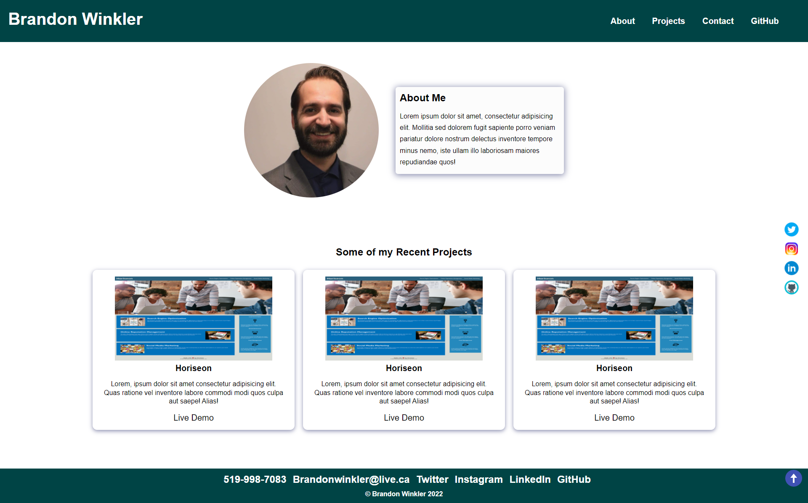

# Portfolio
##  Brandon Winkler Portfolio
A portfolio website built to aid in my career search

### What was your motivation?
- Web development careers dont rely on just a cover letter and resume. Employers need to see skills showcased.

### Why did you build this project?
- I built this project to showcase projects I have worked on. It is a great foundation to showcase my skills that I have been learning during the course. 

### What problem does it solve?
- Employers will be able to view my work to gain a better judgement on if I am suitable for the job.

### What did you learn?
- Building this website, I learned a lot about media querys, containers, and selector types like hover. I also furthered my knowledge in HTML and CSS.

## Sample Website
[DEMO LINK](https://bdubz93.github.io/Portfolio/) 
## Installation
- Click the green code button on GitHub
- Select clone, GitHub Desktop, or download ZIP
- Open downloaded folder and open index.html
## Usage
- A base website layout
- Learning material
- Reference sheet for HTML and CSS elements

## Credits
- https://developer.mozilla.org/en-US/docs/Web/CSS/Specificity
- https://icons8.com/
- https://www.w3schools.com/css/css_rwd_mediaqueries.asp
- https://www.w3schools.com/w3css/w3css_containers.asp
## License
- [APACHE 2.0 LICENSE](license)
---